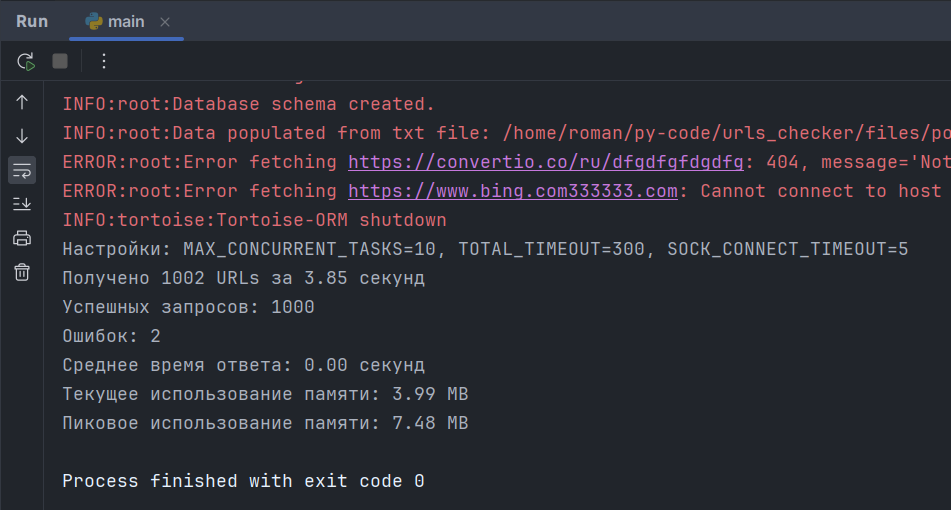

# Массовая проверка доступности url-адресов
### При запуске приложения происходит следующее:
1. Создается база данных и таблица domains (если не существует).
2. Все домены из DOMAIN_FILE записываются в базу данных. Дубликаты пропускаются.
3. Запускается проверка всех доменов на доступность с выводом ТОЛЬКО ОШИБОК в консоль (
   _.env -> DEBUG_).
4. Результаты проверки записываются в базу данных: домен, error_msg, время проверки,
   кол-во успешных проверок, кол-во неуспешных проверок.
5. После проверки всех доменов, выводится статистика по всем доменам и полезная
   статистка по системным ресурсам
6. Приложение завершает работу.

Если кратко - Вам нужно просто положить файл с доменами в папку files, указать этот файл
в .env и запустить приложение. 😎



## Дополнительно

* Файлы с доменами должны быть в формате .txt или .csv и находиться в папке files.
* В каталоге files уже есть несколько файлов с доменами для тестирования.
* Каждый домен на новой строке.
* Наличие **https://** в каждой строке домена - не обязательно.

## Создание виртуального окружения

1. Убедитесь, что у вас установлен Python3 последних версий.
2. Откройте терминал и перейдите в корневую директорию проекта.
3. Создайте виртуальное окружение:

    ```sh
    python3 -m venv .venv
    ```

## Активация виртуального окружения

- **Linux/MacOS**:

    ```sh
    source .venv/bin/activate
    ```

- **Windows**:

    ```sh
    .venv\Scripts\activate
    ```

## Установка зависимостей

После активации виртуального окружения установите все необходимые зависимости:

```sh
pip install -r requirements.txt
```

## Переменные окружения

Проект содержит файл `.env` с комментариями в корневой директории проекта.

## Инициализация базы данных

Инициализируется автоматически при запуске приложения.

## Запуск проекта

Для запуска основного скрипта выполните:

```sh
python main.py
```

## Завершение работы с виртуальным окружением

Для деактивации виртуального окружения выполните:

```sh
deactivate
```


